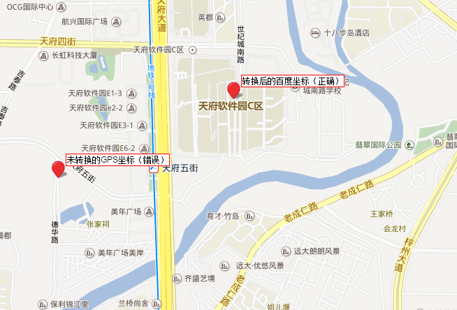

# 百度地图定位问题

## 问题描述

1. Android端通过google地图定位并上传经纬度到服务端，Web端获取经纬度定位有偏差。

2. Android端通过高德地图或者腾讯地图定位并上传经纬度到服务端，Web端获取经纬度定位有偏差。

# 原因分析

GPS设备定位后，获取到的坐标叫做GPS坐标，一般就是经纬度，采用的是`WGS-84`坐标体系。但是在中国，为了保密，任何国内地图产品都不允许直接使用`WGS-84`坐标体系，而是必须使用国测局02年发布的`GCJ-02`坐标体系,也叫做`火星坐标`。比如谷歌中国地图，腾讯，高德都在用这个坐标体系。GCJ-02也是国内最广泛使用的坐标体系。

其他坐标体系，一般都是由`GCJ-02`进过偏移算法得到的。这种体系就根据每个公司的不同，坐标体系都不一样了。比如，百度和搜狗就使用自己的坐标体系，与其他坐标体系不兼容。所以通过百度地图进行展现坐标时，需要进行坐标转换。


# 解决方法

- 通过google地图进行定位，通过百度地图展现

```javascript
const convertorPoint = (lat, lng, callback) => {

    //gps定位坐标转 http://developer.baidu.com/map/jsdemo.htm#a5_1
    let point = new BMap.Point(lng, lat);
    let convertor = new BMap.Convertor();
    convertor.translate([point], 3, 5, data => {
        callback(data)
    });
}
```

- 通过高德或者腾讯地图进行定位，通过百度地图展现

```javascript
const convertorPoint = (lat, lng, callback) => {

    // gps定位坐标转 http://developer.baidu.com/map/jsdemo.htm#a5_2
    let point = new BMap.Point(lng, lat);
    let convertor = new BMap.Convertor();
    convertor.translate([point], 1, 5, data => {
        callback(data)
    });
}
```

- 精度为`104.070625`，纬度为`30.54246`坐标转换前后效果

